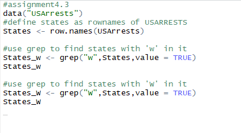
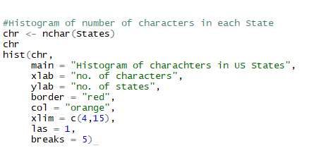
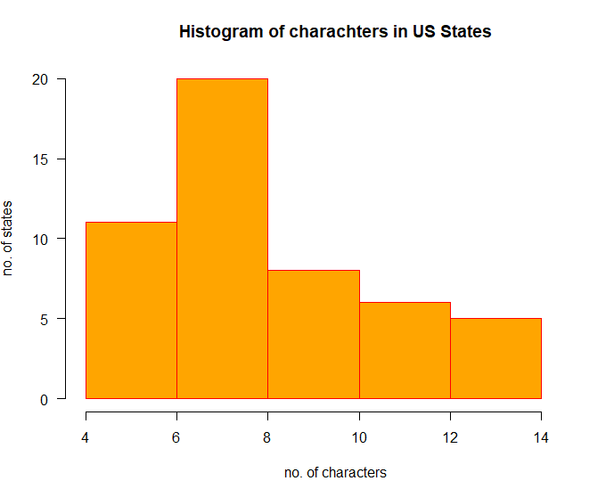

# Assignment-4.3
assignments for Acadgild Data Science with R course

1. States = rownames(US Arrests)
Get states names with ‘w’.
Get states names with ‘W’.

code:

solution:
    
   
    
2. Prepare a Histogram of the number of characters in each US state.

  code:
   
   
   solution:
  
 
